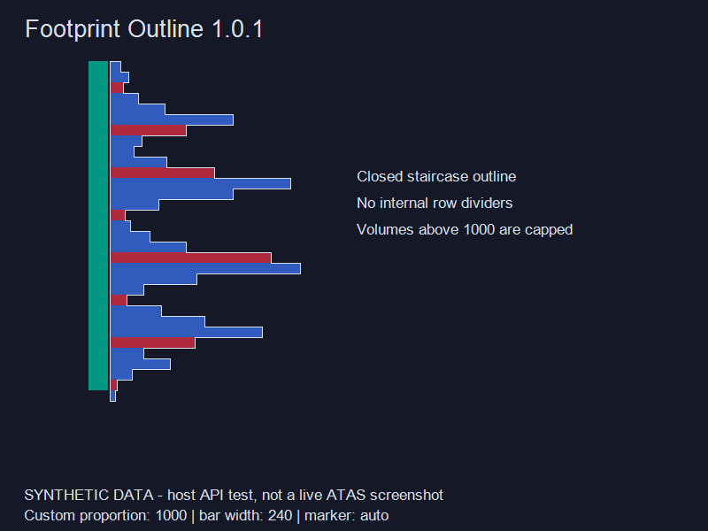

# Footprint Outline / ATAS 成交量外轮廓

为每根 Footprint K 线的 Volume Profile 添加闭合阶梯外轮廓，保留原生横条与配色。当前 K 线随成交更新，历史 K 线随缩放、滚动重新定位。

**版本：1.0.1。目标环境：Windows、ATAS 8.0.14.397、.NET 10。**

## 安装和首次使用

1. 使用发行包中的 **FootprintOutline.dll**。
2. ATAS → 指标 → **Add custom indicator / 添加自定义指标**，选择 DLL。
3. 搜索 **Footprint Outline / 成交量外轮廓**，添加到主图。
4. 图表的 Footprint 模式选择 **Volume Profile**，比例模式选择 **自定义比例**。
5. 在指标中填写完全相同的 **自定义比例值**，并匹配下面的方向指示条设置。

也可以将 DLL 复制到：

~~~text
%APPDATA%\ATAS\Indicators
~~~

如果平台仍在使用旧版本 DLL，请关闭 ATAS 后替换，再重新打开。平台依赖由 ATAS 自身提供，不要把 ATAS 程序目录里的 DLL 一起复制进去。

## 配套图表设置

| ATAS Footprint 设置 | 第一版使用方式 |
|---|---|
| Mode / 模式 | Volume Profile |
| 比例模式 | 自定义比例 |
| 自定义比例值 | 与指标相同，例如两处都填 1000；1000 只是示例 |
| Show Direction Indicator / Marker | 与指标的“显示方向指示条”一致 |
| Direction Indicator Width | 与指标的“方向指示条宽度”一致；0 为自动 |
| Additional Footprint / 附加足迹图 | 关闭 |
| Draw Borders / 每个价位边框 | 关闭 |
| Show Text / 显示数字 | 验收配置关闭，避免没有成交的价位仍被原生文本布局填充 |
| Outer Border / 外部边框 | 可关闭，避免原生矩形边框与阶梯轮廓叠加 |

横条上色可继续使用现有红蓝配色。Volume、Delta 等文字内容不决定本指标的横条长度；长度仅使用 Volume Profile 的总成交量。

**修改 ATAS 的自定义比例后，请同时修改指标中的值。指标不会读取或验证 ATAS 内部比例配置。** 例如 ATAS 改为 2000 而指标仍为 1000，就会出现轮廓比横条宽的现象。

## 指标参数

| 参数 | 默认值 | 说明 |
|---|---:|---|
| 启用轮廓 | 开启 | 控制轮廓与未配置提示 |
| 自定义比例值 | 0 | 0 为未配置，显示提示但不画轮廓 |
| 轮廓颜色 | #D8DEE9 | 默认不透明浅灰白 |
| 线宽 | 1 像素 | 1–8 |
| 显示方向指示条 | 开启 | 与原生设置一致 |
| 方向指示条宽度 | 0 | 0 使用原生自动宽度规则；也可填写明确宽度 |
| 横向偏移 | 0 像素 | 正值向右，负值向左 |
| 宽度修正 | 100% | 仅修正横条宽度，不改变基准位置 |

先匹配比例、方向指示条和附加足迹图设置，再考虑微调。方向指示条会影响横条可用宽度，因此不能只修改横向偏移来代替方向参数。

## 绘制行为

- 沿真实横条凹凸边缘闭合，不画内部价位隔线，不做平滑处理。
- 成交量超过自定义比例值时，按原生规则截断到最大横条宽度；非零小成交量至少为 1 像素。
- 没有成交的价位保留缺口，分离区域分别闭合。
- 使用平台提供的已合并价位，不再手工重新合并 tick，避免价位组错位。价位合并变化后等待平台重算。
- 切换到普通蜡烛图、Delta Profile 或其他非 Volume Profile 模式后隐藏。
- 不更改图表设置；不下单、不访问外部行情接口、不读取账户或平台私有配置。

## 当前验证状态

Release 编译通过，0 警告、0 错误；18 项算法/缓存测试和 16 项真实 ATAS 程序集集成检查通过。

下图由真实指标的 OnRender 输出生成，横条使用**模拟成交量**。它是渲染预览，**不是 ATAS 图表的实际对齐截图**。

已将 DLL 复制到本机 ATAS 自定义指标目录。用户已在 ATAS 图表中完成初步试用，暂未发现异常；目前仍未完成正式的 ≤1 像素误差测量和相同回放条件下的性能对照。详细记录及待验收矩阵见 [验证记录](docs/VALIDATION.md)。

## 1.0.1 性能优化

- 鼠标移动等纯重绘复用可见快照缓冲区，稳定状态下不再为可见 K 线列表分配数组。
- 水平滚动保留仍在视野内且坐标未变的轮廓，只清理离开视野的缓存；缓存大小继续受可见范围限制。
- 相同成交快照不再增加修订号或触发轮廓重建；价位复制改为单次排序和原地合并，减少 LINQ 中间对象。
- 普通、互不重叠的价位行走线采用线性快速路径；出现像素行重叠时自动回退到完整矩形并集算法。

本机几何基准（200 次 × 500 价位）由优化前约 143.5 ms 降至优化后约 26–35 ms，约快 4–5 倍。该数字用于比较算法路径，不代表 ATAS 实际帧率。

## 从源码构建

需要 .NET SDK 10 和本机安装的 ATAS。项目默认引用：

~~~text
C:\Program Files (x86)\ATAS Platform
~~~

~~~powershell
dotnet build .\FootprintOutline.slnx -c Release

# 非默认安装位置
dotnet build .\FootprintOutline.slnx -c Release -p:ATASInstallDir="D:\Apps\ATAS Platform"
~~~

仅构建指标时：

~~~powershell
dotnet build .\src\FootprintOutline\FootprintOutline.csproj -c Release
~~~

输出：src/FootprintOutline/bin/Release/FootprintOutline.dll。

构建、测试、生成模拟预览并打包：

~~~powershell
.\tools\Build.ps1
# 或
.\tools\Build.ps1 -ATASInstallDir "D:\Apps\ATAS Platform"
~~~

发行文件位于 dist，ZIP 内包含 DLL、中文说明、验证记录、模拟预览及 SHA-256 校验值。源码及测试留在项目中；本地分析文件和开发工具不进入发行包。

## 单独运行测试

~~~powershell
dotnet run --project .\tests\FootprintOutline.Tests -c Release

# 真实程序集集成测试；使用模拟数据源，不启动 ATAS、不连接行情
$env:ATAS_INSTALL_DIR = "C:\Program Files (x86)\ATAS Platform"
dotnet run --project .\tests\FootprintOutline.HostTests -c Release
~~~

## 排查对不齐

1. 两处比例必须相同，且 ATAS 当前确实是“自定义比例”。
2. 检查方向指示条开关和宽度，自动宽度应填写 0。
3. 关闭 Additional Footprint 和 Draw Borders。
4. 将偏移恢复 0、宽度修正恢复 100%，再比较。
5. ATAS 升级后需要重新核对像素规则；本版只针对 8.0.14.397 做了程序集验证。

绘图和数据访问使用 [ATAS 官方绘图 API](https://docs.atas.net/en/md_DataFeedsCore_2Docs_2en_20070__Graphics.html) 与 [价位数据 API](https://docs.atas.net/en/md_DataFeedsCore_2Docs_2en_20025__ReceivingProcessingData.html)。

